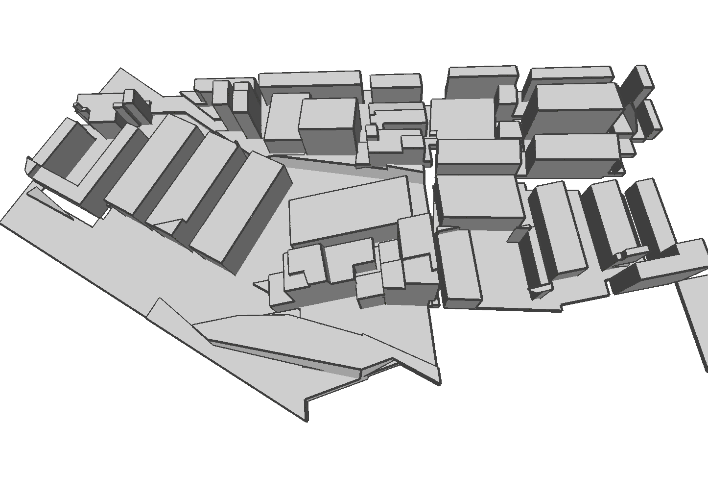

# KSR-imp
Retopology and polygonization of Multi-view Stereo (MVS) meshes of buildings.

MVS building meshes, while visually pleasing, usually have self-intersections, wrong topology, isolated pieces, and large memory size.

The objective of polygonization is the approximation of the original mesh with a set of polygonal surfaces.
The output mesh is watertight and free of self-intersection.

The method is mainly based on [Kinetic Shape Reconstruction.](https://dl.acm.org/doi/10.1145/3376918)

## Dependencies
- [CGAL](https://www.cgal.org/). We use [vcpkg](https://github.com/microsoft/vcpkg) to install CGAL and its dependecies.
- All other dependencies are included in *deps/*
## Examples

| MVS Reconstruction Mesh       | Our Result                |
| ----------                    | -----------               |
|         |       | 
|    |    | 
|    |    | 
|        |        | 
|        |        | 

| Input point cloud            | Our Result                |
| ----------                    | -----------               |
|        |        | 

Note: The official implementation of *Kinetic Shape Reconstruction* may be released in CGAL in future. Our implementation does not represent the quality of official one.